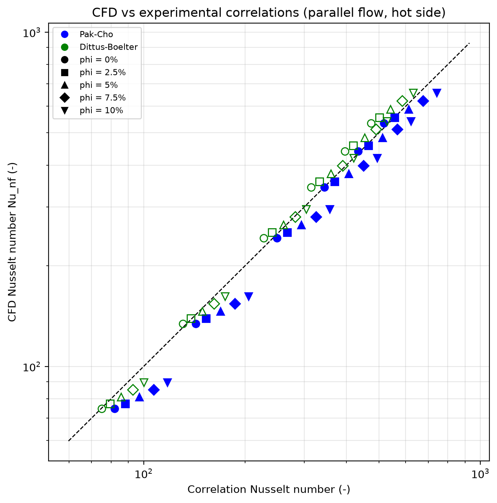
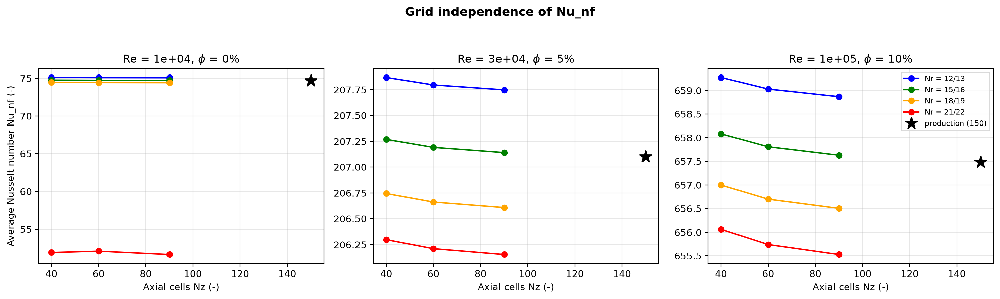
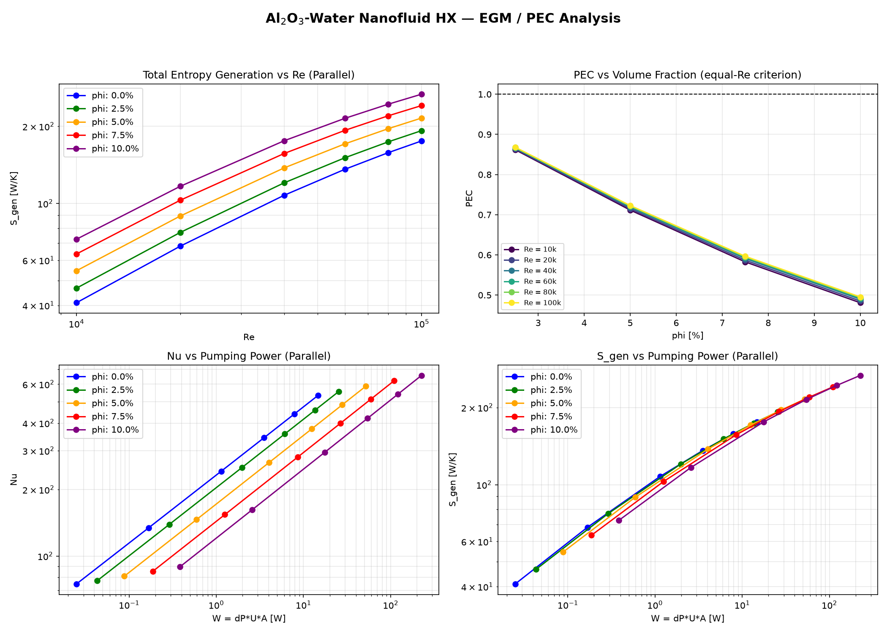

# Nanofluid Double-Pipe Heat Exchanger Solver

2D axisymmetric finite-volume solver for turbulent Al<sub>2</sub>O<sub>3</sub>-water
nanofluid flow in a double-pipe heat exchanger (parallel & counter flow).
Geometry and operating range after Bahmani et al. (2018); validation against
the experimental correlations of Pak&ndash;Cho (1998) and Dittus&ndash;Boelter.

## Physics
- Three zones: inner nanofluid pipe (0-13 mm), steel wall (13-15 mm), water annulus (15-25 mm)
- `flow/`: staggered-grid SIMPLEC momentum solver with standard k-&epsilon; turbulence and
  log-law wall functions &mdash; validated vs. exact Poiseuille (&lt;2%) and Blasius (2.5&ndash;4.5%)
- Flow -> energy coupling on node-identical sub-meshes (zero interpolation): the paper's
  closure, SIMPLEC + k-&epsilon; on both streams
- FVM energy equation, upwind convection, conjugate wall, sparse direct solve
- Thermal wall functions (Jayatilleke T<sup>+</sup>) at the fluid&ndash;solid faces: the
  viscous-sublayer film resistance is included instead of stretching the near-wall eddy
  conductivity to the wall
- Entropy generation (EGM): local S&prime;&prime;&prime;<sub>gen</sub> from the solver's own
  k<sub>eff</sub>/&mu;<sub>eff</sub> fields (Bejan), zone integrals and Bejan number
- Outputs: temperature field, wall Nusselt, LMTD, overall U, effectiveness, S<sub>gen</sub>,
  pressure drop

## Structure
```
nanofluid_hx/
    flow/           SIMPLEC + k-epsilon flow solver, wall functions, SimplecFlow coupling
    turbulence/     model registry (get_model)
    ...             properties, mesh, solver, postprocessing, correlations,
                    entropy generation, plotting
scripts/            run_single_case.py, run_parameter_sweep.py, run_stage1_pipe_validation.py,
                    validate_correlations.py, grid_independence.py, yplus_probe.py, analyze_egm.py
tests/              pytest suite (mesh, properties, energy balance, SIMPLEC, k-epsilon,
                    wall functions, correlations, entropy generation)
results/            generated figures and CSVs
docs/               references
```

## Install
```bash
pip install -e .
```

## Usage
```bash
python scripts/run_single_case.py        # both flow arrangements, saves contours
python scripts/run_parameter_sweep.py    # 6 Re x 5 phi x 2 arrangements; Nu, effectiveness,
                                         # entropy generation, pressure drop -> CSV + figure
python scripts/validate_correlations.py  # parity vs Pak-Cho / Dittus-Boelter
python scripts/grid_independence.py      # Nr x Nz mesh study at 3 operating points
python scripts/analyze_egm.py            # EGM summary, PEC, optimum phi at fixed pumping power
pytest                                   # run the test suite
```

## Results
Temperature contours (Re 3e4, &phi; = 0.05) — hot nanofluid cools through the steel wall
while the annulus water heats up; counter flow gives the more uniform wall &Delta;T:


Nusselt number vs Reynolds number for volume fractions 0&ndash;10% (both arrangements).
Nu rises with Re and with &phi; (nanofluid conductivity enhances the film); at
Re 1e4, &phi; = 0 the solver lands within 0.4% of Dittus&ndash;Boelter:


Validation against experimental correlations: mean |deviation| 9.7% vs
Pak&ndash;Cho over the full 30-point sweep (nanofluid experimental scatter band),
5.4% vs Dittus&ndash;Boelter:



Grid independence at three operating corners (&le;0.83% vs finest valid grid);
grids whose first cell falls at the wall-function y<sup>+</sup> switch (y<sup>+</sup> &asymp; 11.6,
Re 1e4) are excluded as outside wall-function validity &mdash; see
`scripts/yplus_probe.py`:



Entropy generation and performance evaluation: S<sub>gen</sub> rises with Re and &phi;;
Bejan number &asymp; 1 everywhere (heat-transfer irreversibility dominates, friction
share &lt; 1%). PEC &lt; 1 at all conditions and &phi;\* = 0 at fixed pumping power
&mdash; the equal-Re Nu enhancement (+13&ndash;20%) does not survive the viscosity-driven
pumping penalty:



## Roadmap
- [x] SIMPLEC pressure-velocity coupling (`nanofluid_hx/flow/`)
- [x] k-&epsilon; turbulence model with wall functions (`nanofluid_hx/flow/k_epsilon.py`)
- [x] Couple solved flow field into the double-pipe thermal solver (Stage 3)
- [x] Thermal wall functions at the fluid&ndash;solid faces
- [x] Validation vs experimental correlations (Pak&ndash;Cho, Dittus&ndash;Boelter)
- [x] Grid independence study with y<sup>+</sup> validity analysis
- [x] Entropy generation (EGM) and PEC / fixed-pumping-power analysis
- [ ] Publication-quality figures and journal paper
- [ ] Temperature-dependent properties (beyond paper scope)
- [ ] ML surrogate model (deferred)

## References
See [docs/reference.md](docs/reference.md).

## License
MIT  see [LICENSE](LICENSE).
