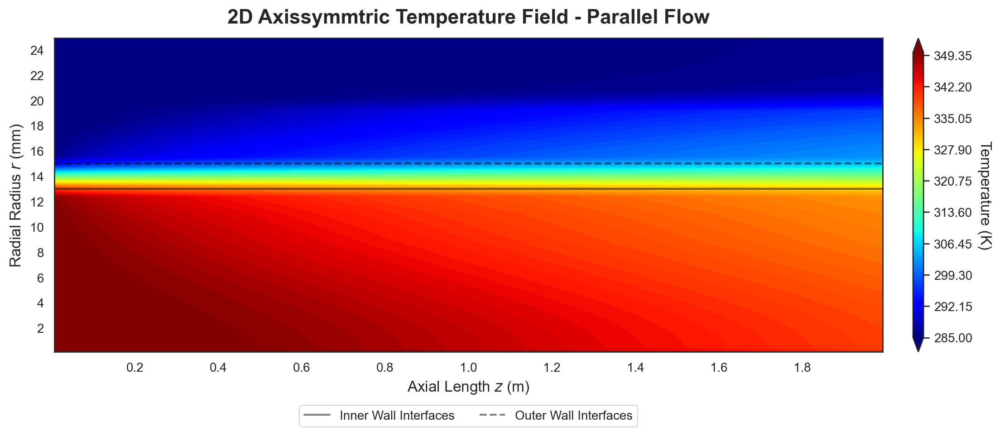
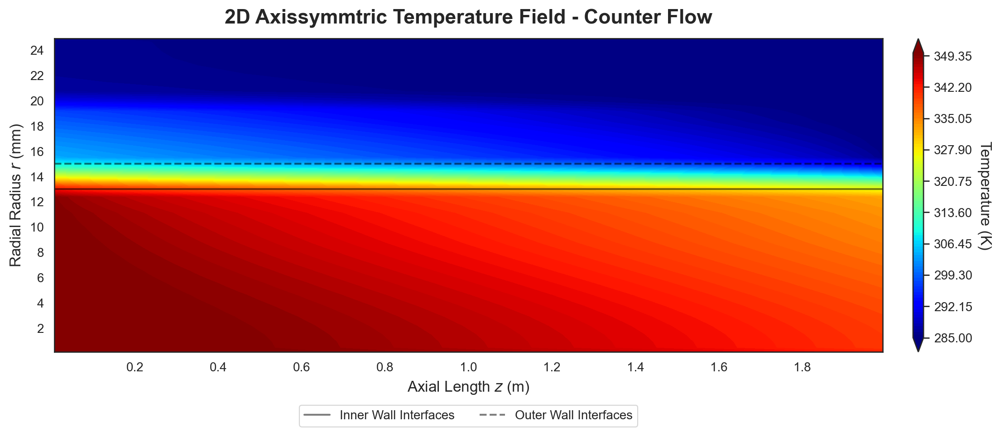
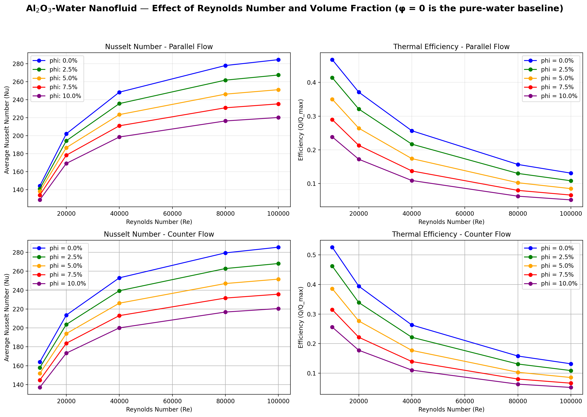

# Nanofluid Double-Pipe Heat Exchanger Solver

2D axisymmetric finite-volume thermal solver for turbulent Al<sub>2</sub>O<sub>3</sub>-water
nanofluid flow in a double-pipe heat exchanger (parallel & counter flow).

## Physics
- Three zones: inner nanofluid pipe (0-13 mm), steel wall (13-15 mm), water annulus (15-25 mm)
- 1/7<sup>th</sup> power-law velocity profile + mixing-length eddy diffusivity (k-&epsilon; reserved)
- FVM energy equation, upwind convection, sparse direct solve
- Outputs: temperature field, Nu, LMTD, overall U, effectiveness

## Structure
```
nanofluid_hx/       core package (properties, mesh, solver, postprocessing, plotting)
    turbulence/     mixing_length (active) | kepsilon (reserved)
scripts/            run_single_case.py, run_parameter_sweep.py
tests/              pytest suite (mesh, properties, energy balance)
results/            generated figures
docs/               references
```

## Install
```bash
pip install -e .
```

## Usage
```bash
python scripts/run_single_case.py        # both flow arrangements, saves contours
python scripts/run_parameter_sweep.py    # $Re \times \phi$ sweep, Nu & effectiveness
pytest                                   # run the test suite
```

## Results




## Roadmap
- [ ] k-epsilon turbulence model (interface reserved in `nanofluid_hx/turbulence/`)
- [ ] Pressure-velocity coupling (velocity currently prescribed)
- [ ] Temperature-dependent properties

## References
See [docs/reference.md](docs/reference.md).

## License
MIT  see [LICENSE](LICENSE).
