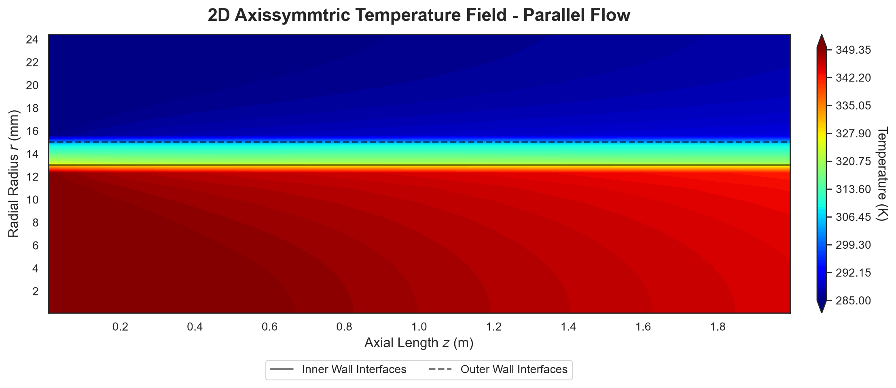
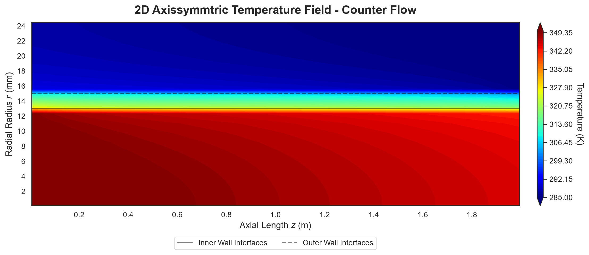
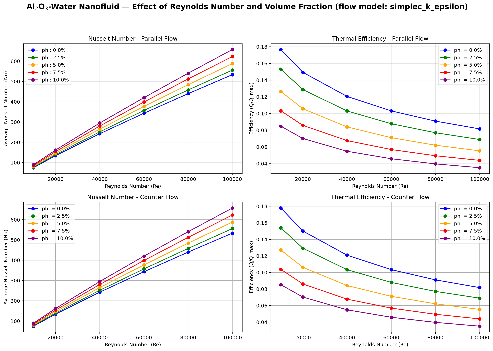

# Nanofluid Double-Pipe Heat Exchanger Solver

2D axisymmetric finite-volume solver for turbulent Al<sub>2</sub>O<sub>3</sub>-water
nanofluid flow in a double-pipe heat exchanger (parallel & counter flow).
Replicates Bahmani et al. (2018), *Advanced Powder Technology* 29(2), 273-282.

## Physics
- Three zones: inner nanofluid pipe (0-13 mm), steel wall (13-15 mm), water annulus (15-25 mm)
- `flow/`: staggered-grid SIMPLEC momentum solver with standard k-&epsilon; turbulence and
  log-law wall functions &mdash; validated vs. exact Poiseuille (&lt;2%) and Blasius (2.5&ndash;4.5%)
- Flow -> energy coupling on node-identical sub-meshes (zero interpolation): the paper's
  closure, SIMPLEC + k-&epsilon; on both streams
- FVM energy equation, upwind convection, conjugate wall, sparse direct solve
- Thermal wall functions (Jayatilleke T<sup>+</sup>) at the fluid&ndash;solid faces: the
  viscous-sublayer film resistance is included instead of stretching the near-wall eddy
  conductivity to the wall
- Outputs: temperature field, wall Nusselt (paper Eqs. 14&ndash;16), LMTD, overall U, effectiveness

## Structure
```
nanofluid_hx/
    flow/           SIMPLEC + k-epsilon flow solver, wall functions, SimplecFlow coupling
    turbulence/     model registry (get_model)
    ...             properties, mesh, solver, postprocessing, plotting
scripts/            run_single_case.py, run_parameter_sweep.py, run_stage1_pipe_validation.py
tests/              pytest suite (mesh, properties, energy balance, SIMPLEC, k-epsilon, wall functions)
results/            generated figures
docs/               references
```

## Install
```bash
pip install -e .
```

## Usage
```bash
python scripts/run_single_case.py        # both flow arrangements, saves contours
python scripts/run_parameter_sweep.py    # 6 Re x 5 phi x 2 arrangements, Nu & effectiveness
pytest                                   # run the test suite
```

## Results
Temperature contours (Re 3e4, &phi; = 0.05) — hot nanofluid cools through the steel wall
while the annulus water heats up; counter flow gives the more uniform wall &Delta;T:




Nusselt number vs Reynolds number for volume fractions 0&ndash;10% (both arrangements).
Nu rises with Re and with &phi; (nanofluid conductivity enhances the film); at
Re 1e4, &phi; = 0 the solver lands within 0.4% of Dittus&ndash;Boelter:



## Roadmap
- [x] SIMPLEC pressure-velocity coupling (`nanofluid_hx/flow/`)
- [x] k-&epsilon; turbulence model with wall functions (`nanofluid_hx/flow/k_epsilon.py`)
- [x] Couple solved flow field into the double-pipe thermal solver (Stage 3)
- [x] Thermal wall functions at the fluid&ndash;solid faces
- [ ] Validation vs. digitized Bahmani et al. figures (Stage 4)
- [ ] Temperature-dependent properties (beyond paper scope)

## References
See [docs/reference.md](docs/reference.md).

## License
MIT  see [LICENSE](LICENSE).
